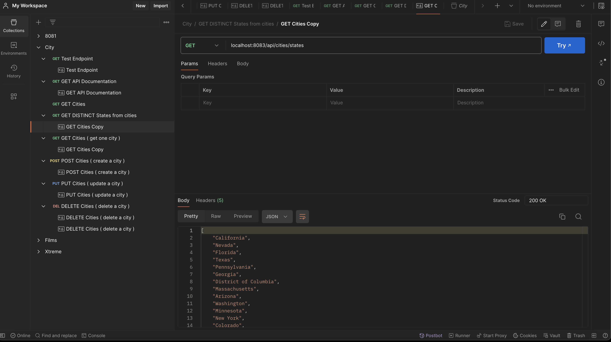
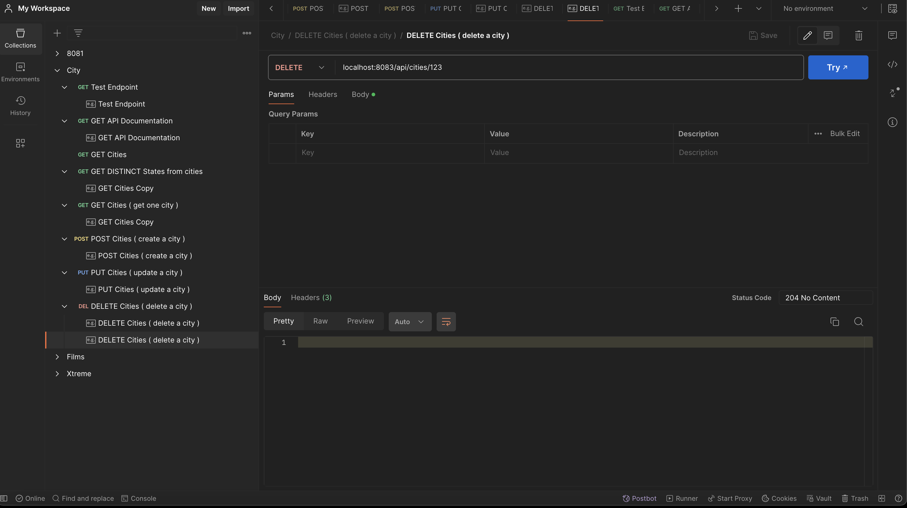
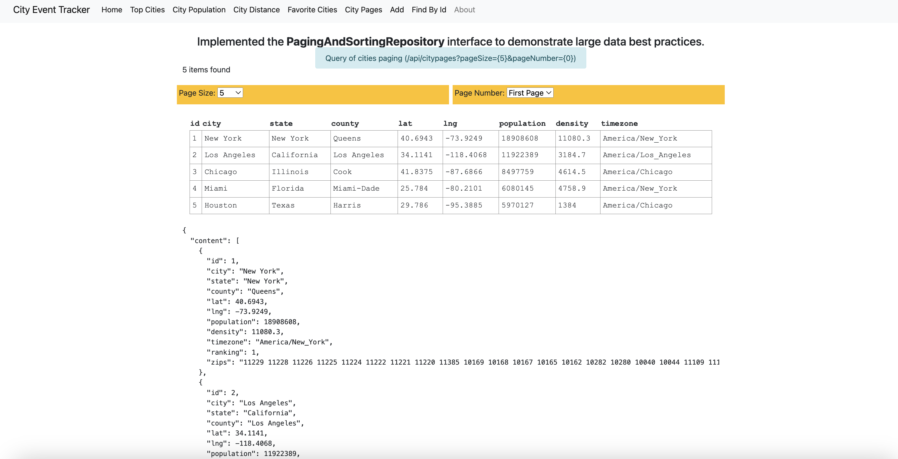
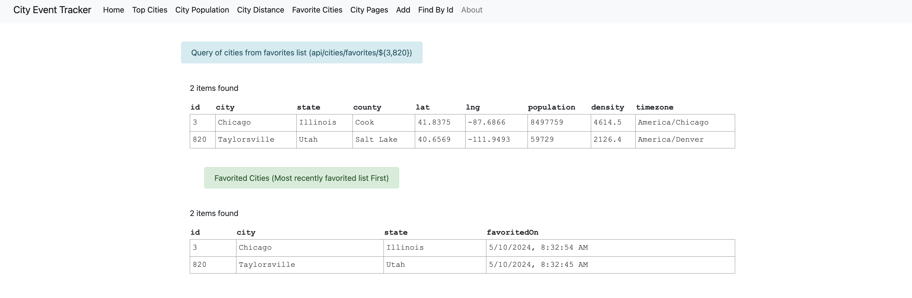
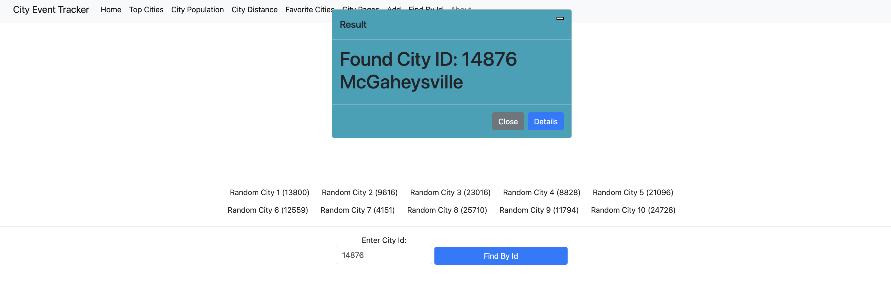
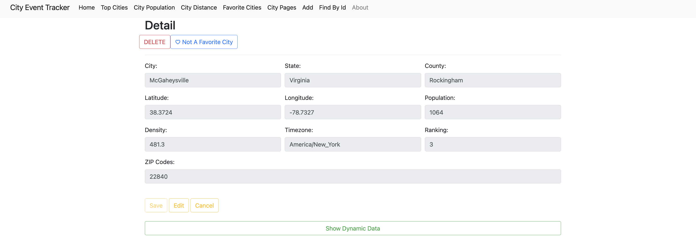
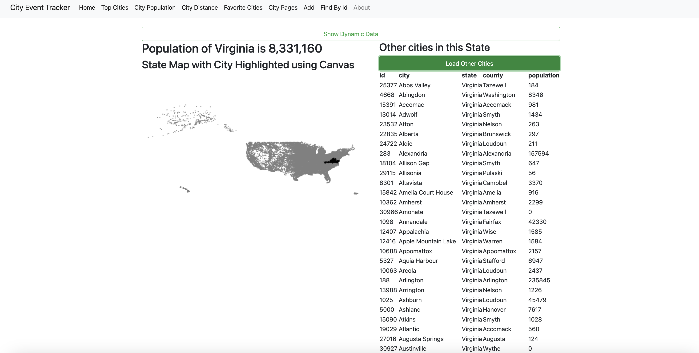

# EventTrackerProject - Sheldon Pasciak, Skill Distillery, May the 4th be with you, 2024!


### Overview

'Event Tracker' is a broad term for anything that keeps track of information over time.

This project will use a MySQL database to practice the concepts of a well formed REST API. Included will be the prinicpal route handlers common for API Development.

This application includes an 'creative commons' dataset of over 31k Cities which are used with the API to demonstrate the REST API methods and data gathering.

### Learning Objectives

- Create a JPA Project

  - Create a Java entity class POJO that models your database table.
  - Map your POJO using JPA.

- Configure a Spring Boot app to publish a REST API.
  - Use Spring REST annotations.
  - Use Spring Data JPA to perform all CRUD operations.
  - Send and receive JSON.

# Credits

- The dataset that was used to populate the 31k + cities for this project was downloaded for free from https://simplemaps.com/data/us-cities.
- This dataset (free version) asks that the source be linked and is therefore noted here.
- If you use the Basic (free) database, you must link back to this page: https://simplemaps.com/data/us-cities from a public webpage where you are using the data.
- If you want to use the data internally, you must link back to this page from your firm's website on a page that can be easily found though links on the root domain.
- The link must be clearly visible to the human eye.


# Technologies Used

- Java
- Spring Boot
- JPA
- MySql
- HTML,CSS
- JavaScript
- Bootstrap
- HTML Canvas

# Lessons Learned

- Practice of complete REST API Development.
- Deploying Spring Boot application and Database to Tomcat10/Apache server hosted on AWS.
- using very complex queries with @Query annotations
- implemented Paging and Sorting as well as very complex queries that were not necessarily required by this assignment.
  - localhost:8083/api/cities/distances?lat=41.8375&lng=-87.6866&howFar=5
- Using AJAX (Async Javascript And XML) requests (implemented for POST requests)
- Using fetch web api (implemented for GET requests)

# API Routes / REST Endpoints

- http://3.15.197.159:8080/CityStatsREST/api - (NOTE: this IP is not static and will change, site will also be offline in near future)

| HTTP Verb | URI                                       | Request Body                                   | Response Body                            | Purpose                                |
| --------- | ----------------------------------------- | ---------------------------------------------- | ---------------------------------------- | -------------------------------------- |
| GET       | `/api`                                    |                                                | Description of the API and its endpoints | API **Index**                          |
| GET       | `/api/ping`                               |                                                | Text `pong`                              | **Test** endpoint                      |
| GET       | `/api/cities`                             |                                                | List < City >                            | **Retrieve** **List** City endpoint    |
| POST      | `/api/cities`                             | Representation of a new _city_ resource        | { City }                                 | **Create** City endpoint               |
| PUT       | `/api/cities/{id}`                        | Representation of updates to a _city_ resource | { City }                                 | **Replace** / **Update** City endpoint |
| DELETE    | `/api/cities/{id}`                        |                                                | No content                               | **Delete** City endpoint               |
| GET       | `/api/cities/states`                      |                                                | List < String > states                   | State Names endpoint                   |
| GET       | `/api/cities/states/{state}`              |                                                | List < City > cities                     | List of cities in state endpoint       |
| GET       | `/api/citypages`?pageSize=10&pageNumber=0 |                                                | List < City > (Pageable)                 | **Retrieve** **List** City endpoint    |

# Additional Stretch Goal Endpoints

api/cities/favorites/6,88,234,532

# Pageable

- Note: With particular concerns for my 31k of rows, I've implemented Pageable to help limit the query size returns in order to efficiently handle the request traffic as well as provide user convenience for large data sets. The front end shall include ability to page through data and efficiently retrieve city rows without the need to return the 5 MB + size of all row data.


# API Maturity

- Care has been taken to create this as a Mature API reflecting the principals of the Richardson maturity model.

```
A model (developed by Leonard Richardson) that breaks down the principal elements of a REST approach into three steps. These introduce resources, http verbs, and hypermedia controls.
```

```Java

	// Create a city
	@PostMapping("cities")

	public City create(@RequestBody City city, HttpServletRequest request, HttpServletResponse response) {

		City createdCity = cityService.create(city);

		if (createdCity == null) {
			response.setStatus(HttpServletResponse.SC_BAD_REQUEST); // 400
		} else {
			response.setStatus(HttpServletResponse.SC_CREATED); // 201
			response.setHeader("Location", request.getRequestURL().append("/").append(createdCity.getId()).toString());

		}

		return createdCity;

	}

```

### Code Highlights

- Creating a tableUtility and other object utilities provided a useful resource to help prevent duplicating code.
- These utilities are customized to provide varying functionality, as shown below.

```javascript
const tableUtility = {
  hiddenColumns: [],
  clickHandler: function (event) {
    event.preventDefault();
    let cityId = Number(event.target.parentElement.getAttribute("data-id"));
    console.log("You clicked on a table row! The city ID is:" + cityId);
  },
  createTable: function (
    dataArray,
    primaryIdColumnName = "id",
    optionalHandlerElement
  ) {
    let table = document.createElement("table");
    table.appendChild(this.createHead(dataArray));
    table.appendChild(
      this.createBody(dataArray, primaryIdColumnName, optionalHandlerElement)
    );
    return table;
  },

  createRowWithThs: function (row) {
    let tr = document.createElement("tr");
    for (prop in row) {
      let th = document.createElement("th");
      th.textContent = prop;
      if (this.hiddenColumns.includes(prop)) {
        th.style.display = "none";
      }
      tr.appendChild(th);
    }
    return tr;
  },

  createRowWithTds: function (
    row,
    primaryIdColumnName,
    optionalHandlerElement
  ) {
    let tr = document.createElement("tr");
    tr.setAttribute("id", "row-" + row[primaryIdColumnName]);
    let title = ""; // hidden columns will be added to the title attribute
    for (prop in row) {
      let td = document.createElement("td");
      td.textContent = row[prop];
      if (this.hiddenColumns.includes(prop)) {
        td.style.display = "none";
        title += `${prop}: ${row[prop]}\n`;
      }
      tr.setAttribute("data-id", row[primaryIdColumnName]);
      tr.setAttribute("title", title); // hidden columns will be added to the title attribute
      tr.appendChild(td);
    }
    if (optionalHandlerElement != null) {
      let td = document.createElement("td");
      let button = document.createElement("button");
      button.setAttribute("data-id", row[primaryIdColumnName]);
      button.setAttribute("data-action", "delete");
      button.classList.add("btn", "btn-danger");
      button.textContent = "Delete";
      button.addEventListener("click", optionalHandlerElement.bind(this, row));
      td.appendChild(button);
      tr.appendChild(td);
    }
    tr.addEventListener("click", this.clickHandler);
    return tr;
  },

  createHead: function (dataArray) {
    let thead = document.createElement("thead");
    thead.appendChild(this.createRowWithThs(dataArray[0]));
    return thead;
  },

  createBody: function (
    dataArray,
    primaryIdColumnName,
    optionalHandlerElement
  ) {
    let tbody = document.createElement("tbody");
    for (let i = 0; i < dataArray.length; i++) {
      let newRow = this.createRowWithTds(
        dataArray[i],
        primaryIdColumnName,
        optionalHandlerElement
      );
      tbody.appendChild(newRow);
    }
    return tbody;
  },
};
```

### Additional code considerations

- As demonstrated briefly in the 'Demo' link of this app, the use of AJAX requests is the main lesson learned here.
- In addition to a few instances where window on load event listeners are added to achieve the load and then subsequent Javascript actions, the use of the defer script tag is used to alleviate the need for the on load event.
- The Demo portion of code demonstrates the clever use of external javascript files and object structure to provide 'utility' and 'service' type functions. These can be see in the tableUtility.js and the cityUtility.js files.
- Although not fully implemented due to the amount of code already present, the below example cityUtility.js would be a good option for best practice is separation of concerns and code reuse.

### Example code for cityUtility.js that serves as a data layer/service object.

```javascript
const cityUtility = {
  loadCities: function (success, failure) {
    let url = urlPrefix + `api/cities`;
    fetch(url)
      .then((response) => {
        if (!response.ok) {
          if (!response.ok) {
            throw new Error("Request failed with status " + response.status);
          }
        } else {
          return response.json();
        }
      })
      .then((data) => {
        return success(data);
      })
      .catch((error) => {
        console.log("Caught Error:", error.message);
        failure(error);
      });
  },
  loadCity: function (id, success, failure) {
    let url = urlPrefix + `api/cities/${id}`;
    fetch(url)
      .then((response) => {
        if (!response.ok) {
          if (!response.ok) {
            throw new Error("Request failed with status " + response.status);
          }
        } else {
          return response.json();
        }
      })
      .then((data) => {
        return success(data);
      })
      .catch((error) => {
        console.log("Caught Error:", error.message);
        failure(error);
      });
  },
};
```

### API Endpoint tests/sample screenshots.

# Endpoint Sample: POSTMAN COLLECTION


# Endpoint Sample: /api/ping - TEST


# Endpoint Sample: /api - DOCUMENTATION


# Endpoint Sample: /api/cities - GET ALL CITIES


# Endpoint Sample: /api/cities/states - GET DISTINCT LIST OF STATES



# Endpoint Sample: /api/cities/states/New Hampshire - GET CITIES in a SPECIFIC STATE


# Endpoint Sample: /api/cities/{cityId} - GET ONE CITY


# Endpoint Sample: /api/cities - CREATE CITY


# Endpoint Sample: /api/cities - CREATE CITY - MATURELY UPDATES 201 HEADER - HATEOAS


# Endpoint Sample: /api/cities - UPDATE CITY


# Endpoint Sample: /api/cities/{cityId} - (SUCCESSFUL DELETE EXAMPLE)



# Endpoint Sample: /api/cities/{cityId} - (UNSUCCESSFUL DELETE EXAMPLE)


# JUnit and Gradle Tests Passing


# JUnit and Gradle Tests Passing


#### Deployment

- Private Reference: https://github.com/SkillDistillery/SD43/blob/main/rest/EventTracker/bootDeployment.md


<hr>

[About The Developer (Sheldon Pasciak)](https://www.linkedin.com/in/sheldonpasciak/)

### Extra Screen Shots of Deployed Site






